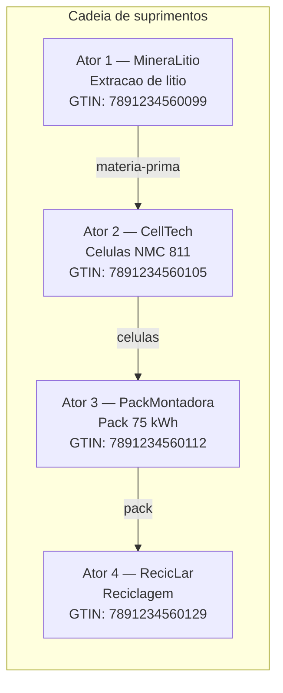
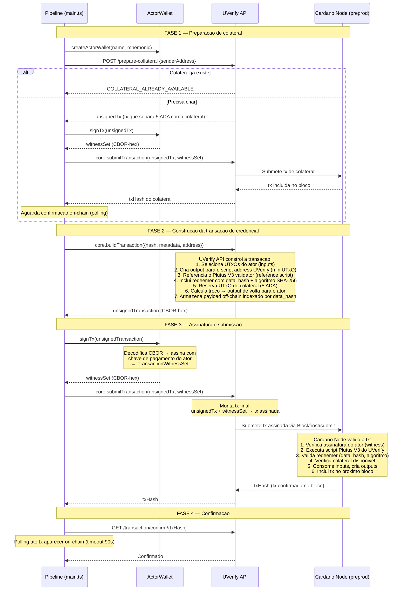
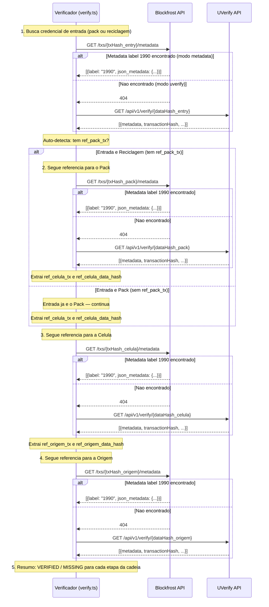
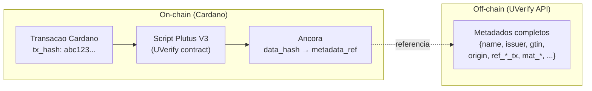
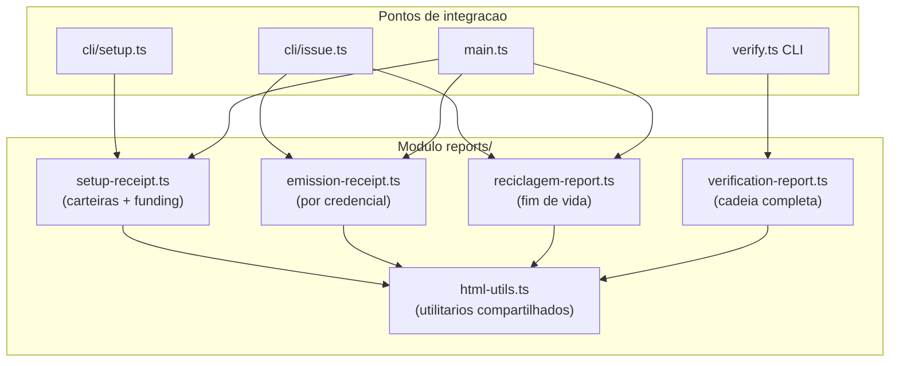
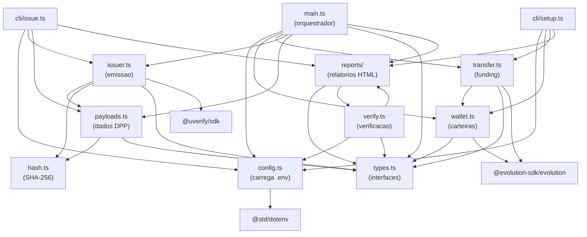

# Arquitetura do DPP — Passaporte Digital de Produto na Cardano

**Documento tecnico de arquitetura do sistema de rastreabilidade de baterias de veiculos eletricos usando blockchain Cardano, UVerify SDK e TypeScript/Deno.**

---

## Indice

- [1. Cadeia de suprimentos](#1-cadeia-de-suprimentos)
- [2. Emissao de credenciais](#2-emissao-de-credenciais)
- [3. Fluxo do verificador](#3-fluxo-do-verificador)
- [4. Estrutura on-chain](#4-estrutura-on-chain)
- [5. Relatorios HTML](#5-relatorios-html)
- [6. Mapa de arquivos](#6-mapa-de-arquivos)
- [7. Analogia — o cartorio digital](#7-analogia--o-cartorio-digital)
- [8. Glossario](#8-glossario)

---

## 1. Cadeia de suprimentos

### Os 4 atores

O DPP modela a cadeia de suprimentos de uma bateria de veiculo eletrico atraves de 4 atores, cada um com **sua propria carteira Cardano**:



**Financiamento:** A carteira principal financia os 4 atores com tADA em uma unica transacao (4 outputs). Cada ator possui sua propria carteira Enterprise independente.

**Referencias on-chain** (cada credencial referencia as anteriores):

```
Ator 2 (celula)     → ref_origem_tx, ref_origem_data_hash
Ator 3 (pack)       → ref_celula_tx, ref_celula_data_hash
Ator 4 (reciclagem) → ref_origem_tx, ref_celula_tx, ref_pack_tx (+ data_hashes)
```

### Carteiras independentes por ator

> **Decisao arquitetural:** Cada ator possui uma carteira Enterprise independente (chave privada propria, endereco proprio). Isso reflete a realidade de uma cadeia de suprimentos onde **cada empresa controla suas proprias chaves** e so ela pode assinar credenciais em seu nome.

| Aspecto | Impacto |
|---------|---------|
| **Autenticidade** | Cada credencial e assinada pela chave privada do ator que a emitiu. Um verificador pode confirmar que a empresa X realmente emitiu a credencial Y. |
| **Separacao de responsabilidades** | Nenhum ator pode assinar em nome de outro. |
| **Realismo** | Simula o cenario real onde MineraLitio, CellTech, PackMontadora e RecicLar sao empresas independentes. |
| **Financiamento** | A carteira principal transfere ADA para cada ator via uma unica transacao com 4 outputs. |

O tipo `ActorWallet` define a interface de cada carteira:

```typescript
// src/types.ts
export interface ActorWallet {
  name: ActorName;
  mnemonic: string;
  address: string;
  /** Assina uma tx nao-assinada, retorna witness set CBOR-hex. */
  signTx: (unsignedCborHex: string) => Promise<string>;
  /** Assinatura CIP-8 para operacoes de estado UVerify. */
  signMessage: (message: string) => Promise<{ key: string; signature: string }>;
}
```

### Encadeamento de referencias

As credenciais formam uma **cadeia de referencias** atraves dos campos `ref_*_tx` e `ref_*_data_hash`:

```
Ator 1 (origem)     → Sem referencias (inicio da cadeia)
    |
    | ref_origem_tx + ref_origem_data_hash
    v
Ator 2 (celula)     → Referencia Ator 1
    |
    | ref_celula_tx + ref_celula_data_hash
    v
Ator 3 (pack)       → Referencia Ator 2
    |
    | ref_pack_tx + ref_celula_tx + ref_origem_tx (+ data_hashes)
    v
Ator 4 (reciclagem) → Referencia Atores 1, 2 e 3
```

A reciclagem referencia **todos os 3 atores anteriores** para rastreabilidade reversa completa. Isso permite que qualquer ponto da cadeia possa ser verificado ate a origem da materia-prima.

### Identificacao unica

Cada credencial e identificada por um **`data_hash`** unico:

```
data_hash = sha256(GTIN + serial)
```

O serial inclui um **sufixo determinisico** derivado do mnemonico da carteira principal, garantindo que cada execucao do pipeline gere data_hashes distintos:

```typescript
// src/hash.ts
export async function mnemonicSuffix(mnemonic: string): Promise<string> {
  const full = await sha256hex(mnemonic);
  return full.slice(0, 6);  // 6 primeiros caracteres hex
}

// Serial final: "ML-JQT-2026-05-a1b2c3" (sufixo unico)
```

---

## 2. Emissao de credenciais

O projeto suporta dois modos de emissao, selecionaveis via `EMISSION_MODE` no `.env`:

- **UVerify** (`EMISSION_MODE=uverify`, padrao): usa smart contracts Plutus V3 via UVerify SDK. Os dados ficam off-chain na API UVerify, ancorados por hash on-chain.
- **Metadata** (`EMISSION_MODE=metadata`): grava o payload DPP inteiro como metadado nativo Cardano (label 1990) diretamente na transacao. Sem smart contracts, paga somente a taxa de rede.

### Arquitetura de emissao (modo UVerify)

A emissao via UVerify usa o SDK (`@uverify/sdk`) com o fluxo `core.buildTransaction()` + `core.submitTransaction()`. Este fluxo de baixo nivel da controle total sobre os campos de metadados, permitindo incluir os campos customizados `ref_*_tx`.



### Componentes do fluxo de emissao

#### 1. UVerifyClient

O SDK e instanciado com os callbacks de assinatura do ator:

```typescript
// src/issuer.ts
const client = new UVerifyClient({
  baseUrl: config.uverifyApiUrl,     // https://api.preprod.uverify.io
  signTx: wallet.signTx,             // Construcao manual de witness (blake2b-256 + Ed25519 + VKeyWitness)
  signMessage: wallet.signMessage,   // COSE.SignData.signData()
});
```

#### 2. Preparacao de colateral

Scripts Plutus V3 exigem um UTxO de colateral (>= 5 ADA). O pipeline prepara automaticamente:

```
POST /api/v1/transaction/prepare-collateral
Body: { "senderAddress": "addr_test1..." }

Respostas possiveis:
  - COLLATERAL_ALREADY_AVAILABLE → prossegue
  - unsignedTransaction → assina + submete → aguarda confirmacao
```

#### 3. Construcao da transacao

```typescript
const buildResult = await client.core.buildTransaction({
  type: "default",
  address: wallet.address,
  certificates: [{
    hash: dataHash,              // sha256(gtin + serial)
    algorithm: "SHA-256",
    metadata: payload,           // Record<string, string>
  }],
});
```

O UVerify constroi uma transacao Cardano que:
- Usa o script Plutus V3 do UVerify para registrar a credencial
- Inclui o `data_hash` como identificador
- Armazena os metadados como dados off-chain referenciados pelo hash on-chain

#### 4. Assinatura hibrida

O sistema usa **dois mecanismos de assinatura** distintos:

```mermaid
graph TD
    subgraph "Assinatura de transacao (signTx)"
        TX1["unsignedCborHex"] --> TX2["Transaction.extractBodyBytes()"]
        TX2 --> TX3["blake2b-256 (body hash)"]
        TX3 --> TX4["PrivateKey.sign() (Ed25519)"]
        TX4 --> TX5["VKeyWitness (vkey + signature)"]
        TX5 --> TX6["TransactionWitnessSet.toCBORHex()"]
        TX6 --> TX7["witnessSet CBOR-hex"]
    end

    subgraph "Assinatura CIP-8 (signMessage)"
        MSG1["message (string)"] --> MSG2["COSE.Utils.fromText()"]
        MSG2 --> MSG3["COSE.SignData.signData()"]
        MSG3 --> MSG4["{key: hex, signature: hex}"]
    end
```



| Tipo | Biblioteca | Entrada | Saida | Uso |
|------|-----------|---------|-------|-----|
| **Transaction signing** | Construcao manual de witness: `Transaction.extractBodyBytes()` + `blake2b` (`@noble/hashes`) + `PrivateKey.sign()` + `VKeyWitness` (evolution-sdk) | CBOR-hex unsigned tx | CBOR-hex witness set | Emissao de credenciais, colateral |
| **Message signing (CIP-8)** | `COSE.SignData.signData()` (evolution-sdk) | String de mensagem | `{key, signature}` hex | Operacoes de estado UVerify |

A construcao manual de witness e necessaria porque `Client.signTx()` do evolution-sdk produz witness sets vazios/malformados para transacoes construidas por servicos externos (e.g. endpoint de colateral do UVerify). A abordagem manual extrai os bytes do body da transacao, calcula o hash blake2b-256, assina com Ed25519 e constroi o VKeyWitness diretamente. Para mensagens, `COSE.SignData.signData()` e usado diretamente porque o UVerify espera o formato CIP-30 `DataSignature` com `{key, signature}` hex.

#### 5. Resiliencia: retentativas automaticas com intervalos crescentes

```typescript
// src/issuer.ts
const MAX_ATTEMPTS = 5;
const INITIAL_DELAY_MS = 40_000;

for (let attempt = 1; attempt <= MAX_ATTEMPTS; attempt++) {
  try {
    // buildTransaction → signTx → submitTransaction
  } catch (e) {
    // "no utxos found" → fatal (carteira vazia)
    // Qualquer outro erro → retenta dobrando o intervalo
    const delay = INITIAL_DELAY_MS * Math.pow(2, attempt - 1);
    await new Promise((r) => setTimeout(r, delay));
  }
}
```

Tratamento de status especiais:
- `COLLATERAL_REQUIRED` → re-prepara colateral e tenta novamente
- `PENDING_TRANSACTION` → aguarda 30s e tenta novamente
- `no utxos found` → erro fatal (carteira vazia, nao retenta)

---

## 3. Fluxo do verificador

### Arquitetura de verificacao

O verificador usa **verificacao dual-path** — tenta Blockfrost metadata primeiro (funciona para modo metadata), com fallback para API UVerify (funciona para modo UVerify):



### Algoritmo de caminhada na cadeia

```
ENTRADA: data_hash (do pack ou reciclagem) + tx_hash (opcional)

1. Busca credencial (dual-path):
   - Se tx_hash disponivel → tenta Blockfrost metadata (label 1990) primeiro
   - Se nao encontrado → fallback para API UVerify (GET /api/v1/verify/{dataHash})

2. Classifica campos do payload:
   - ref_*_tx → referencias a transacoes anteriores
   - ref_*_data_hash → data_hashes das credenciais anteriores
   - mat_* → composicao de materiais

3. Auto-detecta tipo:
   - Se tem ref_pack_tx → e reciclagem (5 passos)
   - Senao → e pack (4 passos)

4. Segue referencias recursivamente:
   - pack → celula (via ref_celula_data_hash)
   - celula → origem (via ref_origem_data_hash)

5. Imprime resumo: VERIFIED / MISSING para cada etapa
```

### Deteccao automatica de reciclagem

```typescript
// src/verify.ts
if (entry.references["pack_tx"]) {
  // Entrada e reciclagem — segue para pack primeiro
  credReciclagem = entry;
  credPack = await verifyCredential(config, packDh, packTx);
} else {
  // Entrada e pack — inicia a cadeia aqui
  credPack = entry;
}
```

### Ponto de entrada via CLI

O verificador suporta **auto-deteccao** do ponto de entrada e tambem aceita um argumento explicito:

```bash
# Auto-deteccao (padrao):
# Se DATA_HASH_ATOR4 existe no .env → comeca pela reciclagem (cadeia de 5 passos)
# Senao → comeca pelo pack via DATA_HASH_PACK (cadeia de 4 passos)
deno task verify

# Ponto de entrada explicito:
deno task verify pack          # Forca inicio pelo pack (DATA_HASH_PACK / TX_HASH_PACK)
deno task verify reciclagem    # Forca inicio pela reciclagem (DATA_HASH_ATOR4 / ATOR4_TX)

# Tasks de conveniencia:
deno task verify-pack
deno task verify-reciclagem
```

**Variaveis de ambiente usadas:**

| Ponto de entrada | data_hash | tx_hash |
|------------------|-----------|---------|
| **pack** | `DATA_HASH_PACK` | `TX_HASH_PACK` |
| **reciclagem** | `DATA_HASH_ATOR4` | `ATOR4_TX` |

**Logica de auto-deteccao** (quando nenhum argumento e passado):

```typescript
// src/verify.ts — CLI entry point
const reciclagemHash = Deno.env.get("DATA_HASH_ATOR4")?.trim();
if (reciclagemHash) {
  // Reciclagem disponivel → cadeia completa de 5 passos
  entryDataHash = reciclagemHash;
  entryTxHash = Deno.env.get("ATOR4_TX")?.trim();
} else {
  // Fallback para pack → cadeia de 4 passos
  entryDataHash = Deno.env.get("DATA_HASH_PACK")?.trim();
  entryTxHash = Deno.env.get("TX_HASH_PACK")?.trim();
}
```

---

## 4. Estrutura on-chain

### Padrao UVerify: anchor on-chain + dados off-chain

> **Nota:** Existem dois padroes de ancoragem DPP em Cardano: (1) **metadata nativa** — payload completo gravado direto na transacao (label 1990), legivel por qualquer indexador sem dependencia externa; e (2) **anchor + off-chain** — apenas o hash on-chain, payload completo no servidor UVerify. Esta implementacao suporta **ambos os padroes**, selecionaveis via `EMISSION_MODE`: `metadata` para metadados nativos (issuer-direto.ts) e `uverify` para anchor + off-chain via UVerify SDK (issuer.ts). O verificador (verify.ts) funciona para ambos os modos usando verificacao dual-path. Para mais detalhes sobre os padroes, consulte o repositorio [cardano-dpp-standards](https://github.com/cardano-foundation/cardano-dpp-standards).

O UVerify usa o padrao de **ancora on-chain** com dados armazenados off-chain:



**O que fica on-chain:**
- Hash da transacao (`tx_hash`)
- Referencia ao script Plutus V3 do UVerify
- Ancora: `data_hash` (sha256 do GTIN + serial)

**O que fica off-chain (UVerify API):**
- Payload completo da credencial (todos os campos `Record<string, string>`)
- Indexado por `data_hash` para busca via `GET /api/v1/verify/{dataHash}`

### Por que este padrao?

| Vantagem | Descricao |
|----------|-----------|
| **Custo** | Armazenar dados completos on-chain seria caro (taxas proporcionais ao tamanho). O hash e minimo. |
| **Privacidade** | Dados sensiveis (serial, composicao detalhada) ficam off-chain, controlados pela API. |
| **Imutabilidade** | O hash on-chain garante que os dados off-chain nao foram alterados — qualquer mudanca invalida o hash. |
| **Verificabilidade** | O verificador busca os dados off-chain e pode recalcular o hash para confirmar integridade. |

### Transacao de emissao — anatomia

Cada credencial gera uma transacao Cardano com esta estrutura:

```
Transacao Cardano
├── Inputs
│   └── UTxO(s) da carteira do ator (inclui ADA para taxa + colateral)
├── Outputs
│   ├── Pagamento ao script UVerify (min UTxO)
│   └── Troco de volta para o ator
├── Scripts
│   └── Plutus V3 reference script (UVerify)
├── Redeemer
│   └── Dados de emissao (hash, algoritmo)
├── Collateral
│   └── UTxO >= 5 ADA (garantia para Plutus)
└── Witnesses
    └── Assinatura da chave de pagamento do ator
```

### Transacao de funding — anatomia

A transacao de financiamento e mais simples (sem scripts). O valor por ator e configuravel via parametro `adaPerWallet` (padrao: 50 ADA):

```
Transacao Cardano (funding)
├── Inputs
│   └── UTxO(s) da carteira principal
├── Outputs
│   ├── N ADA → Ator 1 (origem)
│   ├── N ADA → Ator 2 (celula)
│   ├── N ADA → Ator 3 (pack)
│   ├── N ADA → Ator 4 (reciclagem)
│   └── Troco → carteira principal
└── Witnesses
    └── Assinatura da chave de pagamento da carteira principal
```

---

## 5. Relatorios HTML

### Arquitetura de relatorios

O sistema gera **relatorios HTML auto-contidos** apos cada etapa do pipeline. Cada relatorio e um arquivo HTML completo com CSS inline (sem dependencias externas), responsivo (breakpoint em 600px) e com links clicaveis para o Cexplorer preprod.



### Fluxo de geracao

Cada funcao de relatorio segue o padrao:

1. `generateXxxReport(input)` → retorna string HTML completa
2. `openXxxReport(input)` → chama `generateXxxReport()` + `openHtmlInBrowser()`
3. `openHtmlInBrowser(html, prefix)` → escreve em arquivo temp + abre no navegador

```typescript
// src/reports/html-utils.ts
export async function openHtmlInBrowser(html: string, prefix?: string): Promise<string> {
  const filePath = `${tmpDir}/${prefix}-${timestamp}.html`;
  await Deno.writeTextFile(filePath, html);
  // OS-specific: "open" (macOS), "xdg-open" (Linux), "cmd /c start" (Windows)
  new Deno.Command(program, { args, stdout: "null", stderr: "null" }).spawn().unref();
  return filePath;
}
```

### Esquema de cores por ator

| Ator | Card Border | Header Gradient | Uso |
|------|------------|-----------------|-----|
| origem | `#2e7d32` (verde) | `#1a237e → #283593` | Extracao de litio |
| celula | `#1565c0` (azul) | `#1a237e → #283593` | Fabricacao de celulas |
| pack | `#f9a825` (ambar) | `#1a237e → #283593` | Montagem do pack |
| reciclagem | `#00695c` (teal) | `#004d40 → #00695c` | Reciclagem |

### Tipos de relatorio

| Relatorio | Input | Gerado por | Descricao |
|-----------|-------|-----------|-----------|
| **Setup receipt** | `{ wallets, fundingTxHash, adaPerWallet }` | `cli/setup.ts`, `main.ts` | Tabela de carteiras com badges coloridos, enderecos, mnemonicos mascarados. Card de financiamento. |
| **Emission receipt** | `{ actor, payload, txHash, dataHash }` | `cli/issue.ts`, `main.ts` | Campos do payload, materiais, referencias na cadeia, hashes. Um por credencial emitida. |
| **Reciclagem report** | `{ payload, txHash, dataHash }` | `cli/issue.ts` (ator 4), `main.ts` | Certificado de fim de vida com fluxo Pack → Desmontagem → Reciclagem e rastreabilidade reversa. |
| **Verification report** | `{ origem?, celula?, pack?, reciclagem? }` | `verify.ts` CLI | Diagrama de fluxo da cadeia, cards por credencial verificada, banner de certificacao. |

---

## 6. Mapa de arquivos

### Estrutura do projeto

```
cardano-dpp-passaport/
├── deno.json                    # Configuracao Deno: tasks, import maps, compiler options
├── deno.lock                    # Lock file (builds reproduziveis)
├── .env.example                 # Template de variaveis de ambiente
├── .env                         # Variaveis de ambiente (gitignored)
├── .gitignore
├── README.md                    # Documentacao principal
├── arquitetura-dpp.md           # Arquitetura (este documento)
└── src/
    ├── types.ts                 # Interfaces e tipos centrais
    ├── config.ts                # Carregamento e validacao do .env
    ├── hash.ts                  # Helpers SHA-256 (Web Crypto API)
    ├── wallet.ts                # Geracao de carteiras e callbacks de assinatura
    ├── payloads.ts              # Payloads DPP dos 4 atores
    ├── transfer.ts              # Transferencia de ADA (funding)
    ├── issuer.ts                # Emissao via UVerify SDK (modo uverify)
    ├── issuer-direto.ts         # Emissao via metadados nativos (modo metadata)
    ├── verify.ts                # Verificacao da cadeia (ambos os modos)
    ├── main.ts                  # Orquestrador do pipeline (ambos os modos)
    ├── state.ts                 # Persistencia de estado no .env
    ├── cli/
    │   ├── setup.ts             # CLI: deno task setup
    │   └── issue.ts             # CLI: deno task issue-<ator>
    └── reports/
        ├── html-utils.ts        # Utilitarios HTML compartilhados
        ├── emission-receipt.ts  # Recibo de emissao (por credencial)
        ├── setup-receipt.ts     # Recibo de setup (carteiras + funding)
        ├── verification-report.ts # Relatorio de verificacao da cadeia
        └── reciclagem-report.ts # Certificado de fim de vida
```

### Diagrama de dependencias entre modulos



### Responsabilidade de cada arquivo

| Arquivo | Camada | Dependencias externas | Responsabilidade |
|---------|--------|----------------------|------------------|
| **`types.ts`** | Dados | Nenhuma | Define `ActorName`, `EmissionMode`, `ActorWallet`, `IssuanceResult`, `PipelineConfig`, `DppPayload`, `PayloadResult`. Sem logica, apenas tipos e constantes (`ACTOR_ORDER`, `ACTOR_ENV_KEY`). |
| **`config.ts`** | Infraestrutura | `@std/dotenv` | Carrega `.env`, valida `BLOCKFROST_PROJECT_ID` (rejeita placeholder e chaves mainnet) e `WALLET_MNEMONIC` (deve ter 24 palavras). Valida `EMISSION_MODE` ("uverify" ou "metadata"). Retorna `PipelineConfig` tipado. |
| **`hash.ts`** | Core | Nenhuma (Web Crypto API nativa) | Tres funcoes puras: `dataHash(gtin, serial)` para fingerprint do produto, `hashSerial(serial)` para serial com privacidade, `mnemonicSuffix(mnemonic)` para sufixo unico de 6 hex chars. |
| **`wallet.ts`** | Core | `@evolution-sdk/evolution`, `@noble/hashes` | `generateMnemonic()` gera BIP-39 256-bit. `createActorWallet()` cria Client com Enterprise address, deriva payment key CIP-1852, monta callbacks `signTx` (via construcao manual de witness: blake2b-256 + Ed25519 + VKeyWitness) e `signMessage` (via COSE direto), e expoe o `client` para transacoes diretas (modo metadata). `createMainWalletClient()` cria Client para a carteira principal. |
| **`payloads.ts`** | Dados | `./hash.ts` | Define payloads DPP para os 4 atores com GTINs fixos e seriais dinamicos (sufixo do mnemonico). Cada builder recebe `PayloadEnv` com sufixo e tx hashes anteriores. Retorna `{payload, serial, gtin}`. Usado por ambos os modos de emissao. |
| **`transfer.ts`** | Emissao | `@evolution-sdk/evolution` | `fundActorWallets()` constroi tx unica com 4 outputs (padrao: 50 ADA cada). `waitForConfirmation()` faz polling na API Blockfrost ate tx aparecer on-chain. Identico para ambos os modos. |
| **`issuer.ts`** | Emissao | `@uverify/sdk` | Modo UVerify: `issueAllCredentials()` emite credenciais sequencialmente. Prepara colateral para Plutus V3, faz `core.buildTransaction()` + `signTx()` + `core.submitTransaction()`. Retentativas automaticas com intervalos crescentes (5 tentativas, inicio em 40s, dobrando a cada vez). |
| **`issuer-direto.ts`** | Emissao | `@evolution-sdk/evolution` | Modo Metadata: `issueAllCredentialsDireto()` emite credenciais sequencialmente via metadados nativos (label 1990). Constroi transacoes com o payload DPP completo como metadado. Divide valores > 64 bytes em arrays. Paga somente a taxa de rede. |
| **`verify.ts`** | Verificacao | Nenhuma (fetch nativo) | Verificador dual-path: tenta Blockfrost metadata (label 1990) primeiro, com fallback para API UVerify. `verifyChain()` classifica campos por prefixo, caminha a cadeia de referencias (pack → celula → origem). Auto-detecta reciclagem. Funciona para ambos os modos. |
| **`main.ts`** | Orquestrador | Todos os acima | Executa o pipeline de 6 steps: config → carteiras → funding → confirmacao → emissao → resumo. Seleciona automaticamente `issuer.ts` ou `issuer-direto.ts` com base em `EMISSION_MODE`. Gera relatorios HTML (setup receipt + emission receipts + reciclagem report). Entry point para `deno task run` e `deno task run-metadata`. |
| **`state.ts`** | Core | Nenhuma | Helpers para persistir estado no `.env`: `appendToEnv(key, value)` escreve/atualiza variaveis, `readEnvVar(key)` le variaveis. Usado pelos comandos CLI passo a passo. |
| **`cli/setup.ts`** | CLI | `config.ts`, `wallet.ts`, `transfer.ts`, `reports/` | Gera 4 carteiras de atores, salva mnemonicos e enderecos no `.env`, financia com tADA e aguarda confirmacao. Gera recibo HTML de setup. Entry point para `deno task setup`. |
| **`cli/issue.ts`** | CLI | `config.ts`, `issuer.ts`, `payloads.ts`, `reports/` | Emite a credencial de um unico ator, salva tx hash e data hash no `.env`. Gera recibo HTML de emissao (+ relatorio de reciclagem para o ator 4). Entry point para `deno task issue-<ator>`. |
| **`reports/html-utils.ts`** | Relatorios | `types.ts` | Utilitarios compartilhados: `escapeHtml()`, `cexplorerLink()`, `openHtmlInBrowser()` (escreve HTML em temp file e abre no navegador via `Deno.Command`), `ACTOR_CONFIG` (cores/titulos por ator), `baseStylesheet()` (template CSS), constantes SVG. |
| **`reports/emission-receipt.ts`** | Relatorios | `html-utils.ts`, `types.ts` | Gera recibo HTML auto-contido para uma credencial emitida. Mostra campos do payload, materiais (`mat_*`), referencias na cadeia (`ref_*_tx` com links Cexplorer), hashes e banner de verificacao. Cores por ator. Port do Python `RelatorioEmissaoHTML`. |
| **`reports/setup-receipt.ts`** | Relatorios | `html-utils.ts`, `types.ts` | Gera recibo HTML de setup (sem equivalente Python). Tabela de carteiras com badges coloridos, enderecos, mnemonicos mascarados (primeiras 3 palavras). Card de financiamento com ADA total e link Cexplorer. |
| **`reports/verification-report.ts`** | Relatorios | `html-utils.ts`, `verify.ts` | Gera relatorio HTML de verificacao da cadeia completa. Diagrama de fluxo (3 ou 4 passos), cards por credencial com materiais, banner de certificacao. Port do Python `RelatorioHTML`. |
| **`reports/reciclagem-report.ts`** | Relatorios | `html-utils.ts`, `types.ts` | Gera certificado HTML de fim de vida. Esquema teal, fluxo Pack → Desmontagem → Reciclagem, materiais recuperados, rastreabilidade reversa com links Cexplorer. Port do Python `RelatorioReciclagemHTML`. |

### Dependencias npm/jsr

| Pacote | Registro | Versao | Uso |
|--------|----------|--------|-----|
| `@evolution-sdk/evolution` | npm | `^0` (>= 0.5.9) | Carteiras, chaves CIP-1852, assinatura de transacoes, assinatura CIP-8 (COSE), construcao/submissao de transacoes |
| `@uverify/sdk` | npm | `^0` (>= 0.1.8) | Emissao e verificacao de certificados via smart contracts Plutus V3 |
| `@std/dotenv` | jsr | `^0.225` | Carregamento de variaveis de ambiente do `.env` |

> Todas as versoes exatas estao fixadas no `deno.lock` (commitado para builds reproduziveis).

---

## 7. Analogia — o cartorio digital

Para entender o sistema, pense em um **cartorio digital descentralizado**:

### O cartorio tradicional

No mundo fisico, quando voce registra um documento em um cartorio:
1. Voce leva o documento ao cartorio
2. O tabeliao verifica sua identidade
3. O cartorio registra o documento, carimba com selo e assinatura
4. O registro fica nos livros do cartorio (imutavel, publico)
5. Qualquer pessoa pode solicitar uma certidao para verificar a autenticidade

### O cartorio Cardano (UVerify)

No nosso sistema:

| Cartorio tradicional | Cardano + UVerify |
|---------------------|-------------------|
| Documento | Payload DPP (dados do produto) |
| Tabeliao | Smart contract Plutus V3 (UVerify) |
| Assinatura do tabeliao | Hash on-chain (transacao Cardano) |
| Identidade do signatario | Chave privada do ator (Enterprise address) |
| Livro de registro | Blockchain Cardano (imutavel, publico) |
| Certidao de inteiro teor | `GET /api/v1/verify/{dataHash}` |
| Selo do cartorio | `data_hash = sha256(gtin + serial)` |
| Numero do livro/folha | `tx_hash` da transacao Cardano |

### A cadeia de registros

Imagine que cada etapa da fabricacao da bateria precisa ser "autenticada em cartorio":

1. **MineraLitio** vai ao cartorio e registra: "Extraimos litio de alta pureza em Aracuai, MG"
   - Recebe o numero do registro: `tx_hash_origem`

2. **CellTech** vai ao cartorio e registra: "Fabricamos celulas NMC 811 usando litio registrado em `tx_hash_origem`"
   - O cartorio verifica que `tx_hash_origem` existe
   - Recebe o numero do registro: `tx_hash_celula`

3. **PackMontadora** vai ao cartorio e registra: "Montamos o pack 75 kWh com celulas registradas em `tx_hash_celula`"
   - O cartorio verifica que `tx_hash_celula` existe
   - Recebe o numero do registro: `tx_hash_pack`

4. **RecicLar** vai ao cartorio e registra: "Reciclamos o pack registrado em `tx_hash_pack`, com celulas de `tx_hash_celula` e litio de `tx_hash_origem`"
   - Referencia **todos os registros anteriores**

O **verificador** e como alguem que vai ao cartorio e pede: "Me mostre o registro `tx_hash_pack`, e todos os registros que ele referencia." O cartorio (Blockfrost ou UVerify API) retorna a cadeia completa, verificavel e imutavel.

> **Nota:** Esta implementacao suporta ambos os metodos: o "cofre + protocolo" (anchor + off-chain via UVerify, `EMISSION_MODE=uverify`) e a "carta registrada" (metadata nativa Cardano label 1990, `EMISSION_MODE=metadata`), onde o documento completo fica gravado direto na transacao — sem depender de nenhum servidor externo. Os dois metodos podem coexistir na mesma cadeia e o verificador funciona para ambos.

### A diferenca fundamental

No cartorio tradicional, voce confia no tabeliao (autoridade central). No Cardano:
- **Nao existe autoridade central** — o consenso da rede garante a imutabilidade
- **Qualquer pessoa pode verificar** — a blockchain e publica
- **Ninguem pode alterar** — uma vez registrado, o hash on-chain e imutavel
- **Cada empresa assina com sua propria chave** — como se cada empresa tivesse seu proprio carimbo digital inforjavel

---

## 8. Glossario

| Termo | Descricao |
|-------|-----------|
| **ActorName** | Tipo TypeScript que define os 4 atores: `"origem" \| "celula" \| "pack" \| "reciclagem"`. |
| **ActorWallet** | Interface TypeScript que encapsula uma carteira de ator com endereco, mnemonico e callbacks de assinatura (`signTx`, `signMessage`). |
| **ADA / tADA** | Criptomoeda nativa do Cardano. tADA e ADA de teste (sem valor real). |
| **Backoff exponencial** | Estrategia de retentativa onde o delay dobra a cada tentativa (40s → 80s → 160s → 320s → 640s, 5 tentativas). |
| **BIP-39** | Padrao para gerar mnemonicos de 24 palavras (256 bits de entropia) que derivam chaves criptograficas deterministas. |
| **Blockfrost** | API-as-a-service para Cardano. Evita a necessidade de rodar um no completo. |
| **CIP-8** | Cardano Improvement Proposal para assinatura de mensagens arbitrarias usando COSE (CBOR Object Signing and Encryption). |
| **CIP-30** | Padrao de interface de carteiras Web para dApps Cardano. Define o formato `DataSignature` (`{key, signature}`). |
| **CIP-1852** | Padrao de derivacao de chaves para Cardano: caminho `m/1852'/1815'/account'/role/index`. |
| **Client** | Classe do `@evolution-sdk/evolution` que encapsula um cliente Cardano com carteira, assinatura e construcao de transacoes. |
| **Colateral** | UTxO (>= 5 ADA) exigido para execucao de scripts Plutus. Se o script falhar, o colateral e consumido para compensar validadores. |
| **COSE** | CBOR Object Signing and Encryption — padrao RFC 8152 para assinatura/criptografia. Usado pelo CIP-8 no formato `COSE_Sign1`. |
| **data_hash** | `sha256(GTIN + serial)` — fingerprint unica do produto. Chave de busca na API UVerify. |
| **Deno** | Runtime TypeScript/JavaScript seguro com sistema de permissoes explicitas. Resolve dependencias por URL/import maps. |
| **DPP** | Digital Product Passport — registro digital rastreavel de um produto ao longo do ciclo de vida. |
| **Enterprise address** | Endereco Cardano sem componente de staking (`addr_test1vz...`). Mais simples, usado para carteiras de servico/aplicacao. |
| **evolution-sdk** | Biblioteca TypeScript (`@evolution-sdk/evolution`) para operacoes Cardano: carteiras, assinatura, construcao de transacoes. |
| **GTIN** | Global Trade Item Number — codigo unico por tipo de produto (equivalente ao EAN/UPC). |
| **Import map** | Mecanismo do Deno (definido no `deno.json`) para mapear identificadores de pacote para URLs reais. |
| **IssuanceResult** | Interface TypeScript com `{actor, txHash, dataHash}` — resultado da emissao de uma credencial. |
| **Lovelace** | Menor unidade de ADA (1 ADA = 1.000.000 lovelace). |
| **Mnemonico** | Sequencia de 24 palavras (BIP-39) que codifica a semente de uma carteira. |
| **PayloadEnv** | Interface TypeScript com o sufixo do mnemonico e tx hashes dos atores anteriores. Passada para os builders de payload. |
| **PipelineConfig** | Interface TypeScript com as configuracoes validadas do `.env` (Blockfrost key, mnemonico, URLs). |
| **Plutus V3** | Versao mais recente da linguagem de smart contracts do Cardano. Os contratos UVerify usam Plutus V3. |
| **Preprod** | Testnet de pre-producao do Cardano. Mesmos parametros da mainnet, usa tADA. |
| **ref_*_tx** | Campo no payload DPP que armazena o tx hash da credencial do ator anterior na cadeia. |
| **ref_*_data_hash** | Campo complementar que armazena o data_hash da credencial anterior (para busca na API UVerify). |
| **SHA-256** | Algoritmo de hash criptografico (256 bits). Usado via Web Crypto API nativa do Deno (`crypto.subtle.digest`). |
| **TransactionWitnessSet** | Conjunto de assinaturas (witnesses) de uma transacao Cardano em formato CBOR. |
| **UVerify** | Plataforma de certificacao on-chain para Cardano. Registra credenciais via smart contracts Plutus V3. |
| **UVerifyClient** | Classe do `@uverify/sdk` que encapsula a interacao com a API UVerify para emissao e verificacao. |
| **UTxO** | Unspent Transaction Output — modelo contabil do Cardano onde cada output pode ser gasto exatamente uma vez. |
| **Web Crypto API** | API nativa de criptografia disponivel em Deno e navegadores. Usada para SHA-256 sem dependencias externas. |
