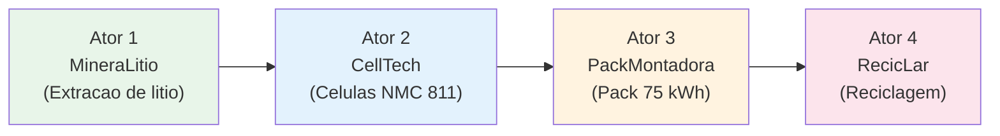
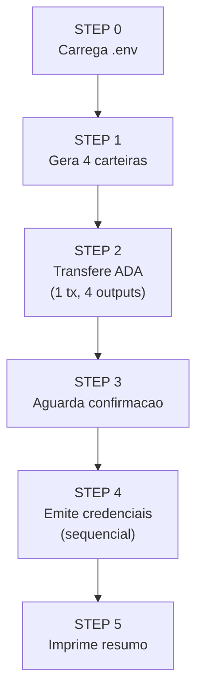
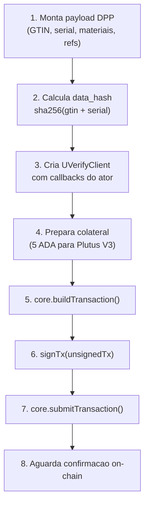
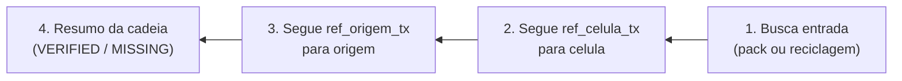
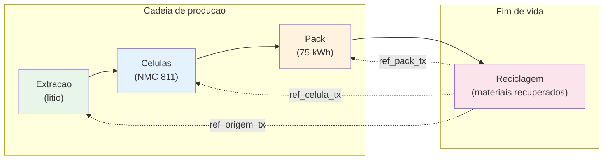

# Mao na Massa — Passaporte Digital de Produto (DPP) com Cardano

**Guia pratico para emitir e verificar credenciais de uma cadeia de suprimentos de baterias usando TypeScript/Deno, UVerify SDK e blockchain Cardano (testnet preprod).**

---

## A historia — De Jequitinhonha a Europa

A partir de **fevereiro de 2027**, a Uniao Europeia passa a exigir um **Battery Passport** digital para todo pack EV que entrar na Europa. Sem passaporte, sem mercado europeu. O Brasil tem os ingredientes — litio no Vale do Jequitinhonha (MG), fabricas em Camacari (BA) e em Sao Bernardo do Campo (SP), regulacao de logistica reversa (PNRS) — mas falta a camada tecnica que prove, para qualquer parte, **de onde aquele pack veio e o que aconteceu com ele**.

Neste hands-on, **voce interpreta os quatro atores** de uma unica cadeia:

- Em **2026**, a *MineraLitio* extrai um lote de Li2CO3 em Aracuai (MG) e emite o primeiro DPP — **origem**.
- Logo depois, a *CellTech* monta celulas NMC em Camacari (BA) e emite **celula**, referenciando *origem*.
- Em Sao Bernardo do Campo (SP), a *PackMontadora* monta o pack de 75 kWh e emite **pack**, referenciando *celula*.
- Em **2028** o pack viaja num EV brasileiro exportado para a UE; depois da vida util em algum estacionamento de Bruxelas, **dez anos depois** o pack volta ao Brasil e cai na *RecicLar*, em Sorocaba (SP), que **verifica a cadeia inteira on-chain antes de processar** — so entao emite o DPP de **reciclagem**, fechando o ciclo.

Cada DPP e uma transacao no Cardano. As **referencias cruzadas** entre as credenciais (`ref_*_tx`) sao o que torna a cadeia auditavel por *qualquer parte* — regulador europeu, comprador europeu, recicladora brasileira — sem pedir permissao a um gatekeeper.

> **Nota sobre rede:** O workshop inteiro — carteira, faucet, Cexplorer, Blockfrost, UVerify — usa **preprod**.

---

## Indice

- [Secao 0 — Pre-requisitos](#secao-0--pre-requisitos)
- [Secao 1 — Entendendo o template DPP](#secao-1--entendendo-o-template-dpp)
- [Secao 2 — Emitindo credenciais via TypeScript](#secao-2--emitindo-credenciais-via-typescript)
- [Secao 3 — Verificacao](#secao-3--verificacao)
- [Secao 4 — Fechando o ciclo (reciclagem)](#secao-4--fechando-o-ciclo-reciclagem)
- [Secao 5 — Troubleshooting](#secao-5--troubleshooting)
- [Glossario](#glossario)

---

## Secao 0 — Pre-requisitos

Antes de comecar, certifique-se de ter os seguintes componentes instalados e configurados:

### Software

| Componente | Versao minima | Descricao |
|------------|---------------|-----------|
| [Deno](https://deno.land/) | 2.0+ | Runtime TypeScript nativo — nao precisa de `npm install`, `node_modules` ou `tsconfig.json`. |
| Git | qualquer | Para clonar o repositorio. |

> **Nota:** Deno resolve dependencias automaticamente na primeira execucao. As versoes estao fixadas no `deno.lock` para builds reproduziveis.

### Contas e chaves

| Servico | O que voce precisa | Link |
|---------|-------------------|------|
| **Blockfrost** | Conta gratuita + projeto **preprod** (API key) | [blockfrost.io](https://blockfrost.io) |
| **UVerify** | API preprod (URL padrao: `https://api.preprod.uverify.io`) | [uverify.io](https://uverify.io) |
| **Carteira Cardano** | [Eternl](https://eternl.io) ou [Lace](https://lace.io) configurada na rede **preprod** | — |
| **tADA** | Minimo ~210 ADA de teste | [Faucet preprod](https://docs.cardano.org/cardano-testnets/tools/faucet/) |

### Setup do repositorio

```bash
# 1. Clone o repositorio
git clone https://github.com/darlisagc/cardano-dpp-passaport.git
cd cardano-dpp-passaport

# 2. Configure o ambiente
cp .env.example .env
```

Edite o arquivo `.env` com suas credenciais:

```env
# Blockfrost API key para Cardano preprod testnet
BLOCKFROST_PROJECT_ID=preprodSUACHAVEAQUI

# Mnemonico da carteira principal (24 palavras) — SOMENTE TESTNET!
# Esta carteira financia as 4 carteiras dos atores (padrao: 50 ADA cada)
WALLET_MNEMONIC=word1 word2 word3 ... word24

# URL da API UVerify (padrao: preprod)
UVERIFY_API_URL=https://api.preprod.uverify.io
```

> **IMPORTANTE:** Use **somente mnemonicos de testnet**. Nunca coloque chaves de mainnet neste arquivo. O `.env` esta no `.gitignore`.

### De onde vem o mnemonico?

Exporte o mnemonico de 24 palavras da sua carteira preprod (Eternl ou Lace). Alternativamente, crie uma carteira nova somente para este workshop e envie tADA do faucet para ela.

---

## Secao 1 — Entendendo o template DPP

### O que e um DPP?

O **Passaporte Digital de Produto** (Digital Product Passport) e um registro digital que acompanha um produto ao longo de todo o seu ciclo de vida. No contexto da regulamentacao europeia de baterias (EU Battery Regulation), cada bateria deve ter um passaporte rastreavel da materia-prima ate o fim de vida.

### A cadeia de suprimentos

Nosso DPP rastreia uma bateria de veiculo eletrico atraves de 4 atores:



| Ator | Empresa | Localidade | Funcao |
|------|---------|------------|--------|
| **Ator 1** | MineraLitio Jequitinhonha | Aracuai, MG | Extracao de litio (materia-prima) |
| **Ator 2** | CellTech Brasil | Camacari, BA | Fabricacao de celulas NMC 811 |
| **Ator 3** | PackMontadora SP | Sao Bernardo do Campo, SP | Montagem do pack de bateria 75 kWh |
| **Ator 4** | RecicLar Sorocaba | Sorocaba, SP | Reciclagem (fim de vida) |

### Campos do template

Cada credencial e um `Record<string, string>` (todos os valores sao strings — requisito do UVerify). Os campos seguem convencoes de nomenclatura:

| Prefixo/Campo | Significado | Exemplo |
|---------------|-------------|---------|
| `name` | Nome do produto/lote | `"Lote Litio Jequitinhonha 2026-05"` |
| `issuer` | Empresa emissora | `"MineraLitio Jequitinhonha Ltda."` |
| `gtin` | Codigo global de identificacao do produto | `"7891234560099"` |
| `uv_url_serial` | Hash SHA-256 do serial (privacidade) | `sha256(serial)` |
| `origin` | Local de producao | `"Aracuai, Vale do Jequitinhonha, MG, BR"` |
| `manufactured` | Data de fabricacao | `"2026-03-13"` |
| `carbon_footprint` | Pegada de carbono | `"4.2 kg CO2e / kg Li2CO3"` |
| `recycled_content` | Percentual de conteudo reciclado | `"0%"` |
| `mat_*` | Composicao de materiais | `mat_litio_carbonato: "98%"` |
| `cert_*` | Certificacoes | `cert_esg_iso14001: "ISO 14001:2015"` |
| `ref_*_tx` | Hash da transacao do ator anterior | `ref_origem_tx: "abc123..."` |
| `ref_*_data_hash` | Data hash da credencial anterior | `ref_origem_data_hash: "def456..."` |

### O encadeamento via `ref_*_tx`

O campo **`ref_*_tx`** e a chave que conecta uma etapa da cadeia a anterior. Ele armazena o hash da transacao Cardano onde a credencial do ator anterior foi registrada. Isso cria uma **cadeia de referencias verificavel**:

```
Ator 4 (reciclagem)
  ├── ref_pack_tx      → tx do Ator 3
  ├── ref_celula_tx    → tx do Ator 2
  └── ref_origem_tx    → tx do Ator 1

Ator 3 (pack)
  └── ref_celula_tx    → tx do Ator 2

Ator 2 (celula)
  └── ref_origem_tx    → tx do Ator 1

Ator 1 (origem)
  └── (sem referencias — inicio da cadeia)
```

O campo complementar **`ref_*_data_hash`** permite localizar a credencial anterior na API UVerify usando `sha256(gtin + serial)` como chave de busca.

### Identificacao unica: GTIN + Serial

Cada credencial e identificada por:
- **GTIN** (Global Trade Item Number): identifica o *tipo* do produto (fixo)
- **Serial**: identifica o *lote* especifico (inclui sufixo unico derivado do mnemonico)

O **`data_hash`** e `sha256(gtin + serial)` — a "impressao digital" do produto no blockchain.

```typescript
// src/hash.ts — como o data_hash e calculado
export async function dataHash(gtin: string, serial: string): Promise<string> {
  return sha256hex(gtin + serial);
}
```

O serial nunca vai para o blockchain em texto claro — apenas o hash (`uv_url_serial = sha256(serial)`), preservando a privacidade.

---

## Secao 2 — Emitindo credenciais via TypeScript

### Visao geral do pipeline

Esta implementacao TypeScript/Deno possui um pipeline **totalmente automatizado**. Um unico comando executa todo o fluxo:

```bash
deno task run
```

O pipeline executa 6 etapas sequenciais:



### Diferenca arquitetural: cada ator tem sua propria carteira

> **Arquitetura de carteiras:** Nesta implementacao, **cada ator possui sua propria carteira** (chave privada independente, endereco Enterprise). Isso simula o cenario real onde somente a empresa responsavel pode assinar credenciais em seu nome.

O pipeline:

1. **Gera 4 mnemonicos BIP-39** independentes (24 palavras, 256 bits cada)
2. **Deriva enderecos Enterprise** via CIP-1852 (sem staking, mais simples)
3. **Transfere ADA** da carteira principal para cada ator (transacao unica com 4 outputs)

```typescript
// src/wallet.ts — geracao de carteira por ator
export function generateMnemonic(): string {
  return PrivateKey.generateMnemonic(256);
}

export async function createActorWallet(
  name: ActorName,
  mnemonic: string,
  blockfrostConfig: { baseUrl: string; projectId: string },
): Promise<ActorWallet> {
  const client = Client.make(preprod)
    .withBlockfrost(blockfrostConfig)
    .withSeed({
      mnemonic,
      accountIndex: 0,
      addressType: "Enterprise",
    });

  const addr = await client.address();
  const addressBech32 = Address.toBech32(addr);
  // ...callbacks de assinatura...
  return { name, mnemonic, address: addressBech32, signTx, signMessage };
}
```

### STEP 0: Carregar configuracao

O modulo `config.ts` le e valida as variaveis do `.env`:

```typescript
// src/config.ts
export function loadConfig(): PipelineConfig {
  const blockfrostProjectId = Deno.env.get("BLOCKFROST_PROJECT_ID")?.trim();
  const mainWalletMnemonic = Deno.env.get("WALLET_MNEMONIC")?.trim();
  // ... validacoes ...
  return { blockfrostProjectId, mainWalletMnemonic, uverifyApiUrl, blockfrostBaseUrl };
}
```

### STEP 1: Geracao de carteiras

Para cada um dos 4 atores, o pipeline:
1. Gera um novo mnemonico BIP-39
2. Cria um `Client` do `@evolution-sdk/evolution` com endereco Enterprise
3. Deriva a chave privada de pagamento para assinatura CIP-8
4. Retorna um `ActorWallet` com dois callbacks de assinatura

### STEP 2: Transferencia de ADA (funding)

Uma **unica transacao com 4 outputs** envia ADA para cada carteira de ator (padrao: 50 ADA, configuravel via parametro `adaPerWallet`):

```typescript
// src/transfer.ts — transacao unica para financiar todos os atores
const txBuilder = client.newTx();

for (const wallet of actorWallets) {
  txBuilder.payToAddress({
    address: Address.fromBech32(wallet.address),
    assets: Assets.fromLovelace(lovelacePerWallet),
  });
}

const signBuilder = await txBuilder.build();
const submitBuilder = await signBuilder.sign();
const txHashObj = await submitBuilder.submit();
```

> **Por que transacao unica?** E mais rapida e evita problemas de encadeamento de UTxOs (onde cada tx subsequente depende do output da anterior).

### STEP 3: Aguardar confirmacao

O pipeline faz polling na API Blockfrost ate que a transacao de funding apareca on-chain (timeout de 120 segundos). Depois, aguarda mais 15 segundos para propagacao de UTxOs.

### STEP 4: Emissao de credenciais

A emissao e **sequencial** porque cada ator referencia o tx hash do ator anterior. O fluxo para cada ator:



#### Preparacao de colateral

Scripts Plutus V3 na Cardano exigem **colateral** (um UTxO de pelo menos 5 ADA que fica reservado). O modulo `issuer.ts` prepara isso automaticamente:

```typescript
// src/issuer.ts — preparacao de colateral
async function prepareCollateral(
  baseUrl: string,
  address: string,
  signTx: (tx: string) => Promise<string>,
): Promise<void> {
  const resp = await fetch(`${baseUrl}/api/v1/transaction/prepare-collateral`, {
    method: "POST",
    headers: { "Content-Type": "application/json" },
    body: JSON.stringify({ senderAddress: address }),
  });
  // ... assina e submete se necessario ...
}
```

#### Emissao via UVerify SDK

O UVerify SDK (`@uverify/sdk`) abstrai a interacao com os smart contracts Plutus V3:

```typescript
// src/issuer.ts — emissao de credencial
const client = new UVerifyClient({
  baseUrl: config.uverifyApiUrl,
  signTx: wallet.signTx,
  signMessage: wallet.signMessage,
});

// Constroi a transacao de emissao
const buildResult = await client.core.buildTransaction({
  type: "default",
  address: wallet.address,
  certificates: [{
    hash,                   // data_hash = sha256(gtin + serial)
    algorithm: "SHA-256",
    metadata: payload,      // Record<string, string> com todos os campos DPP
  }],
});

// Assina e submete
const witnessSet = await wallet.signTx(buildResult.unsignedTransaction);
const txHash = await client.core.submitTransaction(
  buildResult.unsignedTransaction,
  witnessSet,
);
```

#### Retentativas com backoff exponencial

Transacoes podem falhar por motivos transitorios (UTxOs pendentes, rede lenta). O modulo de emissao faz ate **8 tentativas** com backoff exponencial:

```
Tentativa 1: delay 10s
Tentativa 2: delay 20s
Tentativa 3: delay 40s
Tentativa 4: delay 60s (maximo)
...
```

O erro `"no utxos found"` e considerado **fatal** (carteira vazia) e nao e retentado.

#### Dois tipos de assinatura

O `ActorWallet` fornece dois callbacks de assinatura distintos:

| Callback | SDK | Formato | Usado por |
|----------|-----|---------|-----------|
| `signTx` | `Client.signTx()` | TransactionWitnessSet CBOR | Assinatura de transacoes (emissao, colateral) |
| `signMessage` | `COSE.SignData.signData()` | CIP-8 DataSignature `{key, signature}` | Operacoes de estado UVerify (CIP-30) |

```typescript
// src/wallet.ts — assinatura CIP-8
const signMessage = async (message: string) => {
  const payload = COSE.Utils.fromText(message);
  const result = COSE.SignData.signData(addressHex, payload, paymentKey);
  return {
    key: toHex(result.key),
    signature: toHex(result.signature),
  };
};
```

### STEP 5: Resumo

Ao final, o pipeline imprime:
- Hash da transacao de funding + link Cexplorer
- Enderecos das 4 carteiras dos atores
- Para cada credencial emitida: tx_hash, data_hash, link Cexplorer e URL de verificacao UVerify

Exemplo de saida (parcial):

```
================================================================
PIPELINE COMPLETE — Summary
================================================================

Funding tx: abc123...
Cexplorer:  https://preprod.cexplorer.io/tx/abc123...

Issued Credentials:

  origem:
    tx_hash:   def456...
    data_hash: 789abc...
    Cexplorer: https://preprod.cexplorer.io/tx/def456...
    Verify:    https://app.preprod.uverify.io/verify/789abc...
```

---

## Secao 3 — Verificacao

### Verificacao via CLI

```bash
deno task verify
```

O verificador le do `.env` as variaveis `DATA_HASH_PACK` e `TX_HASH_PACK` (impressas pelo pipeline ao final da emissao) e percorre a cadeia de credenciais **de tras para frente**:



Se a credencial de entrada tiver `ref_pack_tx`, o verificador detecta automaticamente que e uma credencial de **reciclagem** e inclui uma etapa adicional para seguir a referencia ao pack.

### Como funciona o verificador

O modulo `verify.ts` usa a API publica do UVerify para buscar credenciais por `data_hash`:

```typescript
// src/verify.ts — busca por data_hash
const resp = await fetch(`${baseUrl}/api/v1/verify/${dHash}`);
const items = await resp.json();
```

Cada credencial retornada contem os metadados (payload) que foram registrados on-chain. O verificador:

1. **Classifica os campos** por prefixo (`ref_*_tx`, `ref_*_data_hash`, `mat_*`)
2. **Extrai as referencias** para as credenciais anteriores
3. **Busca recursivamente** cada referencia ate chegar na origem

```typescript
// src/verify.ts — classificacao de campos
function classifyFields(meta: Record<string, string>) {
  const references: Record<string, string> = {};
  const dataHashes: Record<string, string> = {};
  const materials: Record<string, string> = {};

  for (const [key, value] of Object.entries(meta)) {
    if (key.startsWith("ref_") && key.endsWith("_tx")) {
      references[key.slice(4)] = value;
    } else if (key.startsWith("ref_") && key.endsWith("_data_hash")) {
      dataHashes[key.slice(4)] = value;
    } else if (key.startsWith("mat_")) {
      materials[key] = value;
    }
  }
  return { references, dataHashes, materials };
}
```

### Verificacao via navegador

Para verificar uma credencial individual (util para demos ou leitura de QR code):

```
https://app.preprod.uverify.io/verify/<DATA_HASH>
```

### Saida de exemplo

```
================================================================
DPP Chain Verification
================================================================

Entry data_hash: 789abc...

[1/4] Looking up entry credential...

  Entry:
    Name:     Pack EV 75kWh - SP-2026-05-a1b2c3
    Issuer:   PackMontadora SP Ltda.
    Origin:   Sao Bernardo do Campo, SP, BR
    GTIN:     7891234560112
    Date:     2026-05-22
    CO2:      72 kg CO2e / kWh (cradle-to-gate)
    Materials:
      mat_celulas: 88%
      mat_bms: 3%
    Cexplorer: https://preprod.cexplorer.io/tx/def456...

[2/4] Following reference to celula...
  ...

[3/4] Following reference to origem...
  ...

[4/4] Chain verification summary:
  ==================================================
  VERIFIED: Origem (lithium) → Lote Litio Jequitinhonha 2026-05
  VERIFIED: Celula (cells) → Celulas NMC 811 - Lote BA-2026-05-a1b2c3
  VERIFIED: Pack (battery) → Pack EV 75kWh - SP-2026-05-a1b2c3
  ==================================================
```

---

## Secao 4 — Fechando o ciclo (reciclagem)

O Ator 4 (RecicLar) representa o **fim de vida** da bateria. Sua credencial e especial porque referencia **todos os 3 atores anteriores**, criando rastreabilidade reversa completa:

```typescript
// src/payloads.ts — payload de reciclagem (referencias aos 3 atores)
const payload: DppPayload = {
  // ... dados do produto ...
  ref_pack_tx: env.ator3Tx,
  ref_pack_data_hash: await dataHash(GTIN_PACK, serialPack),
  ref_celula_tx: env.ator2Tx,
  ref_celula_data_hash: await dataHash(GTIN_CELULA, serialCelula),
  ref_origem_tx: env.ator1Tx,
  ref_origem_data_hash: await dataHash(GTIN_ORIGEM, serialOrigem),
};
```

A credencial de reciclagem inclui dados sobre **materiais recuperados** (litio, niquel, cobalto, cobre), fechando o ciclo de vida do produto. Quando o verificador encontra uma credencial com `ref_pack_tx`, ele sabe que e uma credencial de reciclagem e percorre a cadeia completa:

```
reciclagem → pack → celula → origem
```

### Fluxo completo do ciclo de vida



---

## Secao 5 — Troubleshooting

### Erros comuns e solucoes

| Erro | Causa | Solucao |
|------|-------|---------|
| `BLOCKFROST_PROJECT_ID is required` | Variavel nao definida no `.env` | Preencha com sua API key da Blockfrost (projeto preprod). |
| `WALLET_MNEMONIC must be 24 words` | Mnemonico incompleto ou invalido | Verifique se sao exatamente 24 palavras separadas por espacos. |
| `No unlocked UTxOs available` | UTxO da transacao anterior ainda pendente | O codigo faz retentativas automaticas com backoff exponencial. Aguarde. |
| `COLLATERAL_REQUIRED` | Colateral nao preparado para Plutus V3 | O modulo de emissao prepara colateral automaticamente (5 ADA). Se falhar, aguarde a confirmacao da tx anterior. |
| `no utxos found` | Carteira vazia | Verifique se o funding tx foi confirmado e se ha ADA suficiente (~210 ADA na carteira principal). |
| Timeout na confirmacao | Testnet preprod com blocos lentos | O timeout padrao e 90s para emissao e 120s para funding. Aguarde e tente novamente. |
| `Cannot read properties of null` | Status message nulo do UVerify | Tratado internamente com null safety. Se persistir, tente novamente. |
| `ATOR1_TX is required before issuing celula` | Tentativa de emitir fora de ordem | As credenciais devem ser emitidas sequencialmente. O pipeline automatico faz isso. |
| `Deno is not defined` / `deno: command not found` | Deno nao instalado | Instale Deno 2.0+: `curl -fsSL https://deno.land/install.sh \| sh` |
| `error: Uncaught PermissionDenied` | Permissoes insuficientes do Deno | Use `deno task run` (que inclui as flags corretas) em vez de executar diretamente. |

### Flags de permissao do Deno

O Deno usa um modelo de permissoes explicitas. O `deno.json` define as tasks com as flags corretas:

```json
{
  "tasks": {
    "run": "deno run --allow-net --allow-env --allow-read --allow-write src/main.ts",
    "verify": "deno run --allow-net --allow-env --allow-read src/verify.ts"
  }
}
```

| Flag | Motivo |
|------|--------|
| `--allow-net` | Acesso a APIs Blockfrost e UVerify |
| `--allow-env` | Leitura de variaveis de ambiente |
| `--allow-read` | Leitura do arquivo `.env` |
| `--allow-write` | Escrita de logs (apenas no `run`) |

### Dicas de depuracao

1. **Verifique o saldo da carteira principal** antes de executar:
   - Use o [Cexplorer preprod](https://preprod.cexplorer.io/) para consultar o endereco
   - Minimo necessario: ~210 ADA (200 ADA para os 4 atores + taxas)

2. **Consulte transacoes no Cexplorer:**
   ```
   https://preprod.cexplorer.io/tx/<TX_HASH>
   ```

3. **Verifique credenciais no UVerify:**
   ```
   https://app.preprod.uverify.io/verify/<DATA_HASH>
   ```

4. **Se o pipeline falhar no meio**, voce pode reexecutar com `deno task run` — novas carteiras e seriais serao gerados automaticamente (o sufixo e derivado do mnemonico da carteira principal via `sha256`).

---

## Glossario

### Blockchain / Cardano

| Termo | Descricao |
|-------|-----------|
| **ADA** | Criptomoeda nativa da blockchain Cardano. |
| **tADA** | ADA de teste, sem valor real. Usada nas testnets. |
| **BIP-39** | Padrao para gerar mnemonicos de 24 palavras que derivam chaves criptograficas. |
| **CIP-8** | Cardano Improvement Proposal para assinatura de mensagens arbitrarias (COSE). |
| **CIP-30** | Cardano Improvement Proposal que define a interface de carteiras Web (dApp connector). O formato `DataSignature` (`{key, signature}`) vem desta especificacao. |
| **CIP-1852** | Padrao de derivacao de chaves para Cardano (baseado em BIP-44): caminho `m/1852'/1815'/account'/role/index`. |
| **Colateral** | UTxO reservado (>= 5 ADA) exigido pela rede Cardano para executar scripts Plutus. Garante que mineradores sao compensados se o script falhar. |
| **COSE** | CBOR Object Signing and Encryption — padrao usado por CIP-8 para assinar mensagens no formato `COSE_Sign1`. |
| **Enterprise address** | Endereco Cardano sem componente de staking. Mais simples, ideal para carteiras de servico. |
| **Lovelace** | Menor unidade de ADA. 1 ADA = 1.000.000 lovelace. |
| **Mnemonico** | Sequencia de 24 palavras que codifica a chave privada de uma carteira. |
| **Plutus V3** | Versao mais recente da linguagem de smart contracts do Cardano. Os scripts UVerify usam Plutus V3. |
| **Preprod** | Testnet de producao do Cardano. Imita a mainnet mas usa tADA sem valor real. |
| **TransactionWitnessSet** | Conjunto de assinaturas (witnesses) de uma transacao Cardano em formato CBOR. |
| **UTxO** | Unspent Transaction Output — modelo de contabilidade do Cardano. Cada output de transacao e um UTxO que pode ser gasto exatamente uma vez. |

### DPP (Digital Product Passport)

| Termo | Descricao |
|-------|-----------|
| **DPP** | Digital Product Passport (Passaporte Digital de Produto). |
| **GTIN** | Global Trade Item Number — codigo unico que identifica o *tipo* do produto (equivalente ao codigo de barras EAN/UPC). |
| **Serial** | Identificador unico do lote especifico. Nunca armazenado em texto claro on-chain. |
| **data_hash** | `sha256(gtin + serial)` — impressao digital unica do produto. Usada como chave de busca no UVerify. |
| **ref_*_tx** | Campo em uma credencial DPP que aponta para o tx hash da credencial do ator anterior. |
| **SHA-256** | Algoritmo de hash criptografico. Usado para gerar data_hash e hash de seriais. |

### UVerify

| Termo | Descricao |
|-------|-----------|
| **UVerify** | Plataforma de certificacao on-chain para Cardano. Fornece smart contracts Plutus V3 para registrar e verificar credenciais. |
| **UVerify SDK** | Biblioteca JavaScript (`@uverify/sdk`) para interagir com os smart contracts UVerify programaticamente. |

### TypeScript / Ferramentas

| Termo | Descricao |
|-------|-----------|
| **Deno** | Runtime TypeScript/JavaScript seguro. Nao precisa de `node_modules` e resolve dependencias por URL. |
| **evolution-sdk** | Biblioteca (`@evolution-sdk/evolution`) para operacoes Cardano: carteiras, assinatura, construcao de transacoes. |
| **Blockfrost** | Servico de infraestrutura que fornece API para acessar a blockchain Cardano sem rodar um no proprio. |
